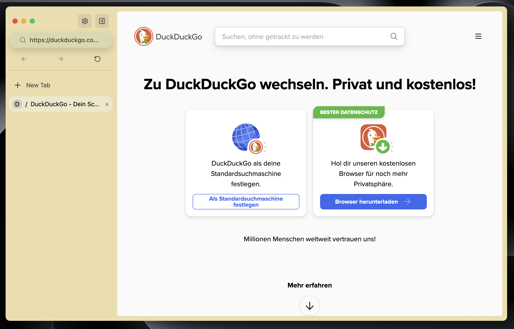
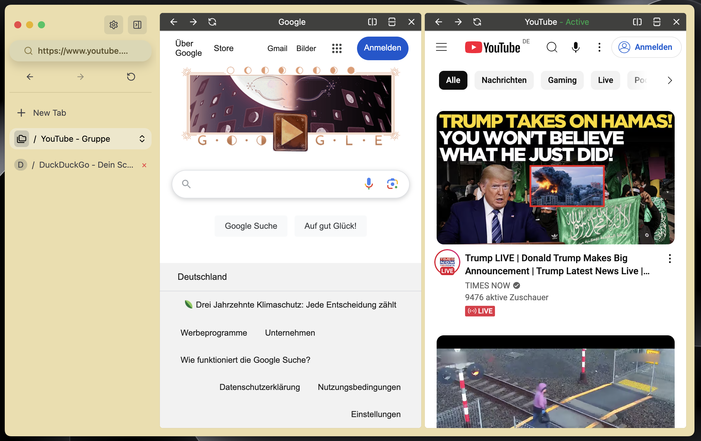

# Meridian

A web browser built with Electron and React.




One of the main reasons why, created this browser, is to test how good a browser based on electron could be.

## Credits

This Browser is a tribute to the fading Arc Browser, which isnt the focus of the Browser Company anylonger. Thats why i wanted an Open Source alternative.


## Project Setup

### Install

```bash
$ npm install
```

### Development

```bash
$ npm run dev
```

### Build

```bash
# For windows
$ npm run build:win

# For macOS
$ npm run build:mac

# For Linux
$ npm run build:linux
```
